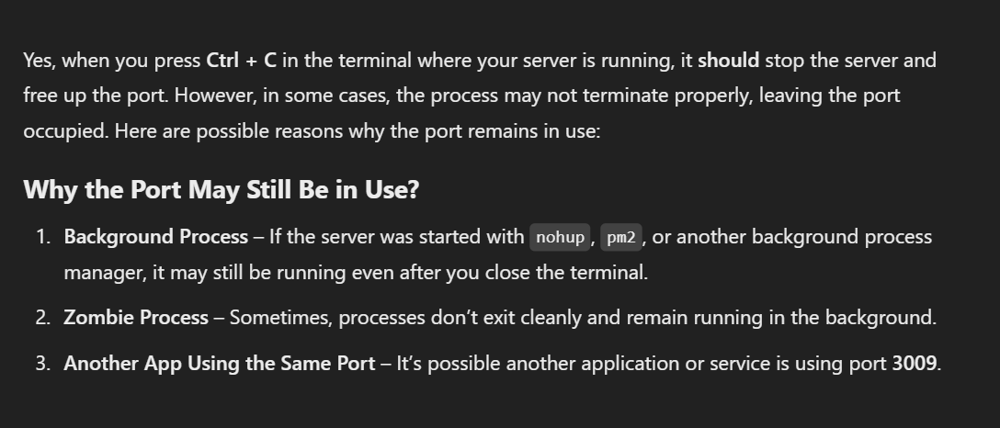
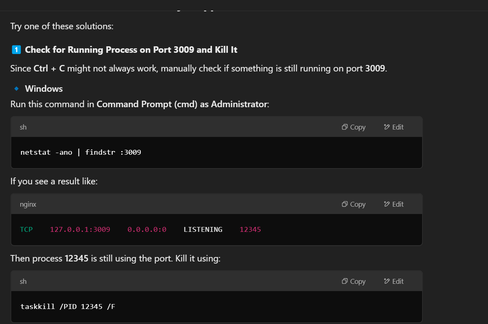
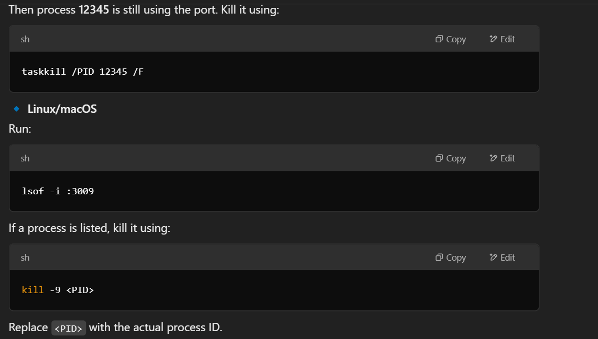

we will be using ES6a

For professional and meaningful GitHub commits, you should focus on logical milestones in your project where significant features, integrations, or fixes were completed. Below are the refined commit messages with appropriate timestamps:

1. **Project Initialization** (`00:00 - 02:18`)
   * Commit: `Initialize project with basic setup and dependencies`
2. **Project Preview Added** (`02:18 - 07:08`)
   * Commit: `Add project preview and initial documentation`
3. **Server Setup Completed** (`07:08 - 13:36`)
   * Commit: `Set up Express server with basic configuration`
4. **Database Setup & User Registration API** (`13:36 - 33:57`)
   * Commit: `Configure database and implement user registration endpoint`
5. **User Authentication Middleware & Login API** (`33:57 - 47:07`)
   * Commit: `Add user authentication middleware and login endpoint`
6. **Redis Integration for Session Management** (`47:07 - 53:40`)
   * Commit: `Integrate Redis for session management and caching`
7. **User Logout & Authentication Completion** (`53:40 - 01:02:39`)
   * Commit: `Implement user logout and finalize authentication flow `
8. **React Setup & Routing Configuration** (`01:02:39 - 01:08:18`)
   * Commit: `Set up React project and configure React Router`
9. **User Authentication UI (Login & Register)** (`01:08:18 - 01:27:21`)
   * Commit: `Complete login and registration UI with API integration`
10. **User Context Setup for Global State Management** (`01:27:21 - 01:33:59`)
    * Commit: `Set up user context for global state management`
11. **Project Creation API & UI Implementation** (`01:33:59 - 02:06:49`)
    * Commit: `Implement project creation API and UI`
12. **User & Project Management API** (`02:06:49 - 02:38:31`)
    * Commit: `Implement API to fetch users and projects & add user functionality`
13. **Project View & UI Enhancements** (`02:38:31 - 03:17:14`)
    * Commit: `Enhance project UI with improved layout and integration`
14. **Messaging UI & User Collaboration Features** (`03:17:14 - 04:02:38`)
    * Commit: `Implement messaging UI and user collaboration functionalities`
15. **Socket.io Setup & Real-time Communication** (`04:02:38 - 04:20:17`)
    * Commit: `Integrate Socket.io for real-time messaging and authentication`
16. **Secure Socket Authentication & User Authorization** (`04:20:17 - 04:48:05`)
    * Commit: `Enhance profject security with socket authentication and route protection`
17. **Refactor Messaging System & Improve UI Updates** (`04:48:05 - 05:13:17`)
    * Commit: `Refactor messaging system for improved handling and UI updates`
18. **AI Service Integration & Prompt Engineering** (`05:13:17 - 05:31:55`)
    * Commit: `Integrate AI service and optimize prompt engineering techniques`
19. **Project Component Refactoring & State Management** (`05:31:55 - 06:01:19`)
    * Commit: `Refactor project component and improve state management for messages`
20. **Enhance AI Service & Improve Response Handling** (`06:01:19 - 06:26:17`)
    * Commit: `Enhance AI response structure and add example prompts`
21. **File Tree Structure & Code Editor Integration** (`06:26:17 - 06:46:13`)
    * Commit: `Implement file tree structure and integrate code editor functionality`
22. **Optimize Project Structure & File Handling** (`06:46:13 - 06:53:59`)
    * Commit: `Refactor AI service and improve project component structure`
23. **Web Container API Integration & Syntax Highlighting** (`06:53:59 - 07:15:36`)
    * Commit: `Integrate Web Container API for file handling and syntax highlighting`
24. **Run Functionality for Web Container** (`07:15:36 - 07:41:00`)
    * Commit: `Add run functionality for Web Container and improve editor structure`
25. **Enhance UI & Improve Iframe Support** (`07:41:00 - 08:01:15`)
    * Commit: `Add iframe support and improve UI for message box`
26. **File Tree Management & UI Enhancements** (`08:01:15 - 08:08:30`)
    * Commit: `Add file tree management and update UI for better usability`

These commit messages are concise, professional, and meaningful while aligning with standard Git practices. 🚀

## How to kill running server?








Redis stores data in memory/RAM unlike MongoDB

install Redis insight

> star mthd to explain project
>
> ```
>
>
> ```
